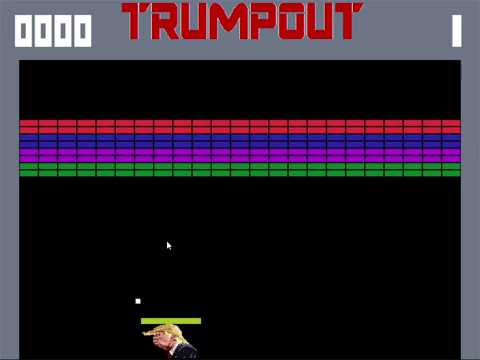

# Atari-Breakout
###My own Atari Breakout, with a comedic flare

<h3>Info:</h3>
<ul>
  <li>Made with Direct-X and Chili Framework</li>
  <li>No physics engine => all physics naturally coded by yours truly</li>
  <li>Only graphics functions to start out with were individual PutPixel() calls</li>
<ul>
  
<h3>To Play:</h3>
<ul>
<li>Download Engine.exe in release folder</li>
<li>Run and enjoy!</li>
</ul>
